# Deploying 2 tier in Azure
## Part one: Set up sub-net
### 1. Click on Virtual Networks in Azure services
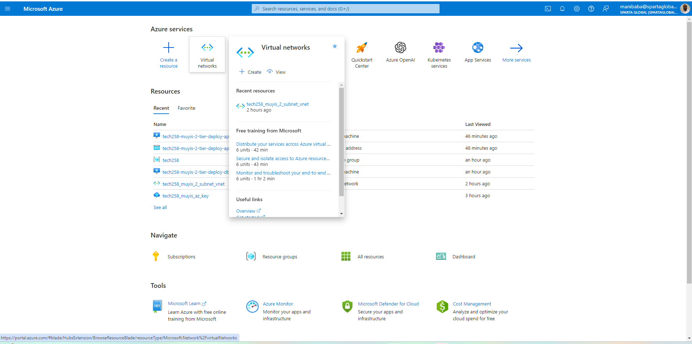
### 2. Click on create
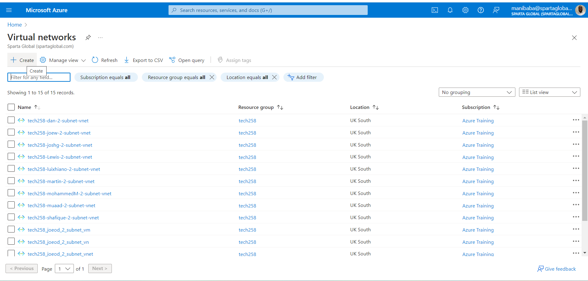
### 3. Choose resource group, network name and region
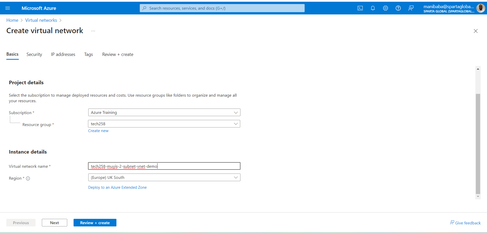
### 4. Set IP address space to 10.0.0.0/16, add TWO subnets one public-subnet 10.0.2.0/24 one private-subnet 10.0.3.0/24
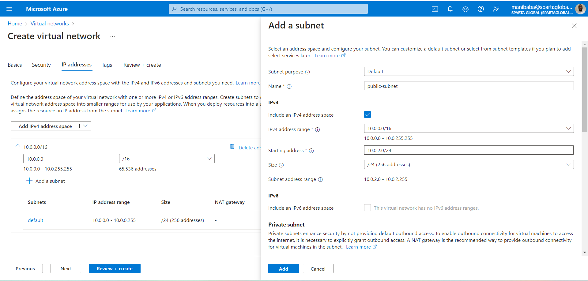
#### Tick enable private subnet for private-subnet
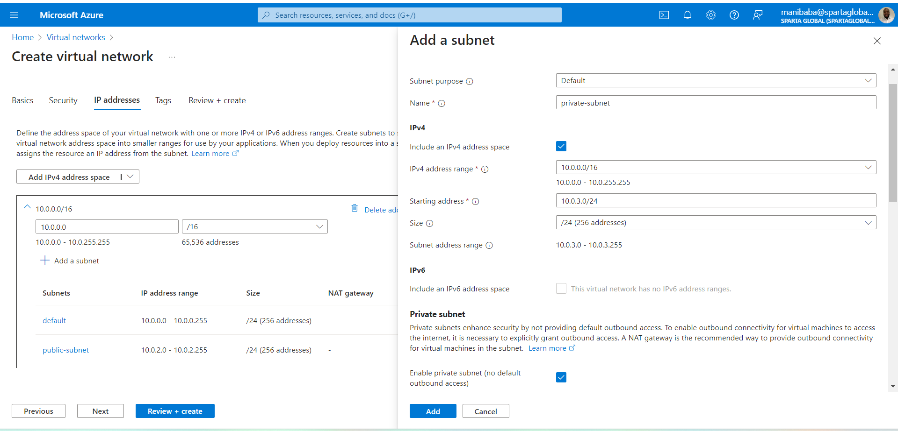
**Why two subnets?** The public one will be for public access via HTTP port 80 and the private subnet is for access for the app instance to the database instance only. This creates greater security for our databases making sure no one else can gain access to them.
### DONE!! Should look like this
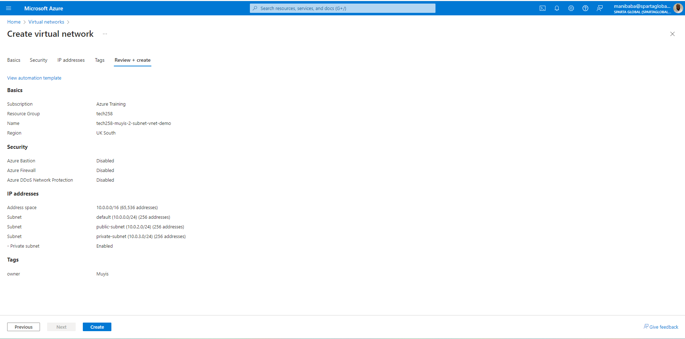
## Part two: Set up VMs
### 1. Click on Virtual Machines in Azure services
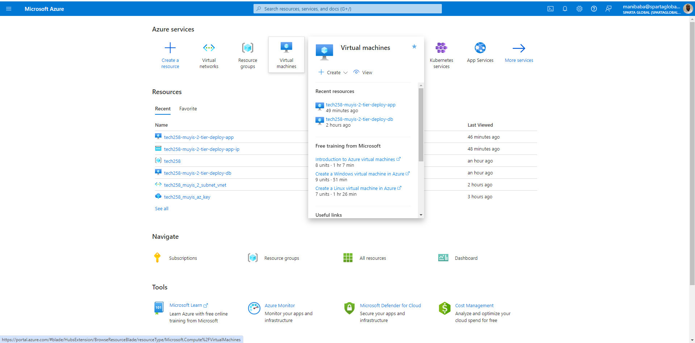
### 2. Click on create (create a new one not a preset)
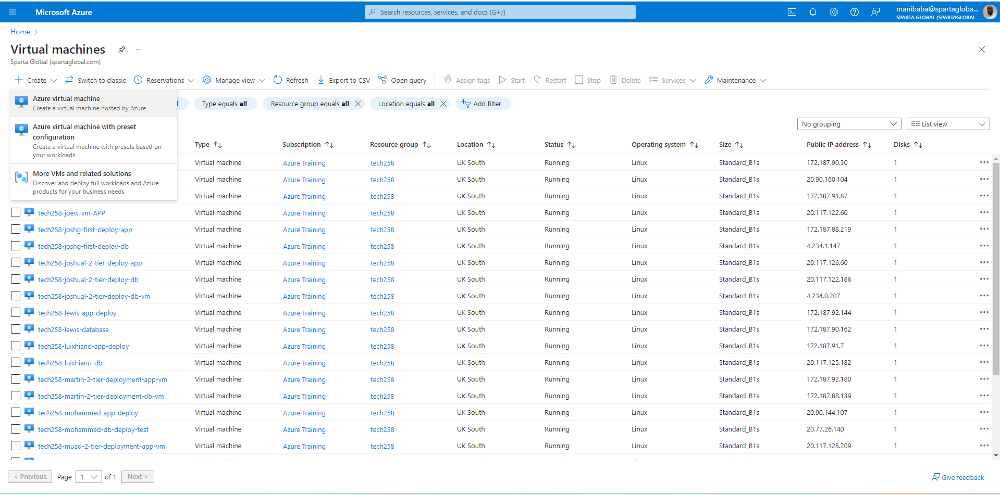
### 3. Select your resource group, type our the name of your vm machine, choose your region, select the standard security type (Ubuntu 22.04 Gen2), choose the right image, and choose the corresponding size of the VM (B1s)
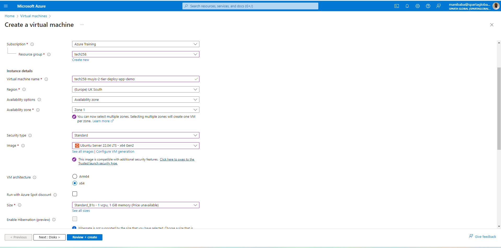
### 4. Change user name (adminuser), use existing ssh key stored in Azure or create a new one. 
#### For the app instance include HTTP inbound port, for the database only allow SSH
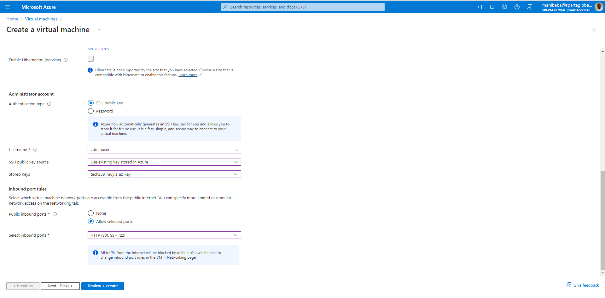
### 5. Choose standard OS disk
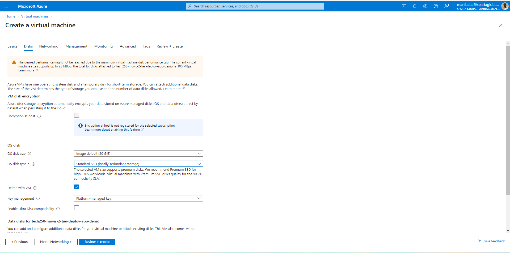
### 6. Networking - choose the virtual network you setup before and select the private subnet for your database, then the public subnet for your app
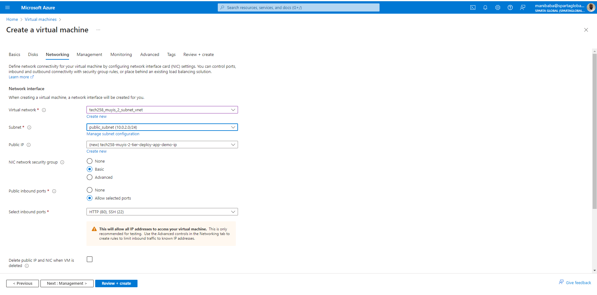
### DONE!! Should have these features

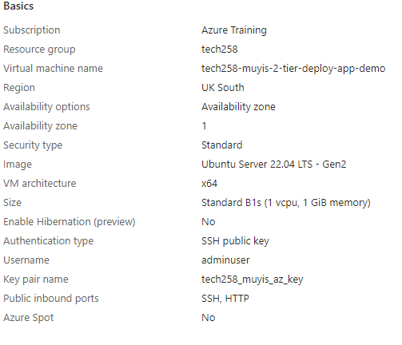
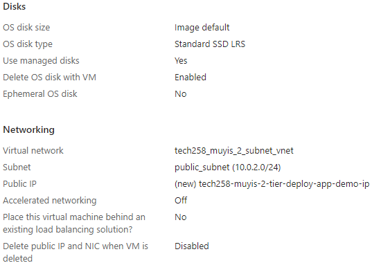
### No port 3000
Because we set our network to to have multiple subnets, our instances can communicate between one another with just their IP addresses without needing a port rule to be created.