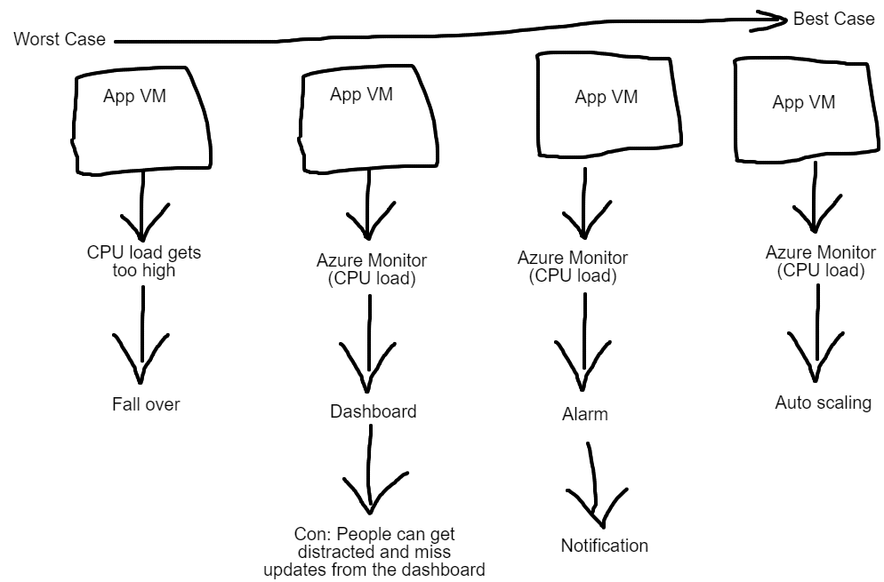

# Monitoring
## Different Approaches
This image shows different approaches to monitoring and the flow of each approach. As shown the best approach would be to automatically scale the VM when an alert is triggered.<br>

## Setting up a dashboard
After setting up your VM, in the monitoring section in overview you can create a dashboard by clicking on the pin icon as shown. You will have to name the dashboard!<br>

You can access your dashboard by searching for the "Dashboard Hub" in the search bar.<br>

After entering your dashboard you will be able to edit it however you like<br>

## Load Testing
You are able to test your VM and how it reacts to requests by using the commands below. Apache bench is the package that will be installed to do these get requests.
```bash
# Install apache bench
sudo apt-get install apache2-utils

# use VMs public IP
172.187.91.219

ab -n 1000 -c 100 http://172.187.91.219/

# -n is number of requests
# -c is speed

ab -n 10000 -c 200 http://172.187.91.219/

ab -n 20000 -c 300 http://172.187.91.219/

ab -n 40000 -c 300 http://172.187.91.219/
```
# Alert Management
There are two ways to create an alert rule: 
1. You can do it via your dashboard on the metric being tracked
2. You can go to alerts in the monitoring section of you VM
Either way you will come to this screen where you have to configure the alert settings


# Auto Scaling
Scaling up and down increases size of VM<br>

Auto scaling increases the number of VMs you can scale out or in<br>