# Monitoring
## Different Approaches
This image shows different approaches to monitoring and the flow of each approach. As shown the best approach would be to automatically scale the VM when an alert is triggered.<br>

## Setting up a dashboard
After setting up your VM, in the monitoring section in overview you can create a dashboard by clicking on the pin icon as shown. You will have to name the dashboard!<br>

You can access your dashboard by searching for the "Dashboard Hub" in the search bar.<br>

After entering your dashboard you will be able to edit it however you like<br>

## Load Testing
You are able to test your VM and how it reacts to requests by using the commands below. Apache bench is the package that will be installed to do these get requests.
```bash
# Install apache bench
sudo apt-get install apache2-utils

# use VMs public IP
172.187.91.219

ab -n 1000 -c 100 http://172.187.91.219/

# -n is number of requests
# -c is speed

ab -n 10000 -c 200 http://172.187.91.219/

ab -n 20000 -c 300 http://172.187.91.219/

ab -n 40000 -c 300 http://172.187.91.219/
```
# Alert Management
There are two ways to create an alert rule: 
1. You can do it via your dashboard on the metric being tracked
2. You can go to alerts in the monitoring section of you VM
Either way you will come to this screen where you have to configure the alert settings


# Scaling 
Scaling up and down increases size of VM.<br>

VM scale sets can increases or decreases the number of VMs you can scale out or in.<br>

This image shows how a VM scale set is made and the thought process behind it.<br>
By starting off from a basic hard disk file you can create a custom image with the right provisions (files) to run your app in your instance.<br>

### Take aways
- You need to configure the VM scale set's custom autoscale. According to your own criteria you can set the minimum default and max number of machines, you can also change therequired CPU load to start the autoscaling
- You need to create a custom image
- **High availability** comes from your VMs being in different zones  and launches a new instance if there is a lot of traffic. The default/ minimum of 2 VMs gives robustness
- **High scalability** comes from the VM scale set adapting when the set CPU load is reached
- This happens within the public subnet
- An external Load balancer, organises internet traffic depending on the individual VMs capacity.
- Custom autoscale CPU threshold takes an average and scales instances accordingly.
## Pre-Requisites
1. **WORKING SCRIPT:** It is imperative your script to provision your apps instance works otherwise nothing else will work continuing on.
2. **Robust image:** The image must run smoothly even if there are small mistakes in the user data when running it.
3. Now you can create a VM scale set with a working script and robust image.

## Setting up a VM Scale Set
### Go to VM Scale Set resource and click on create
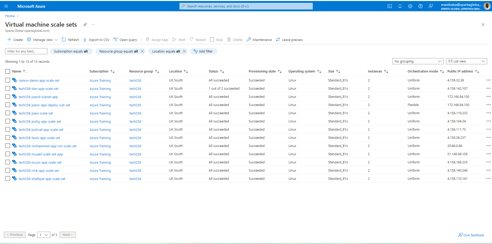
### Make the scale set available in all zones
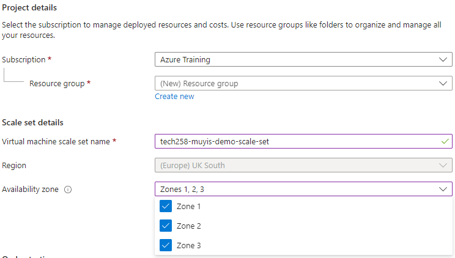
### Make all instances uniform and start configuring the custom autoscale
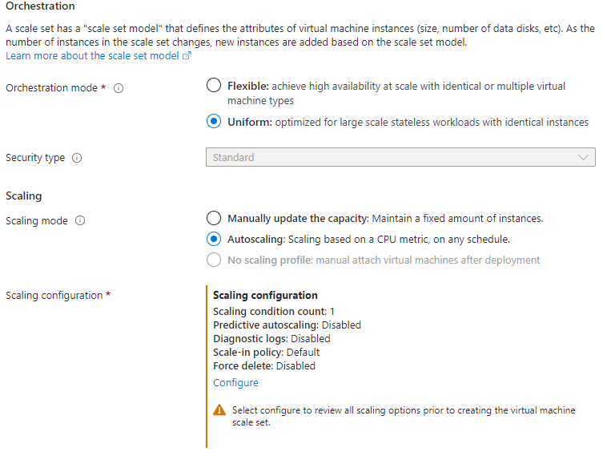
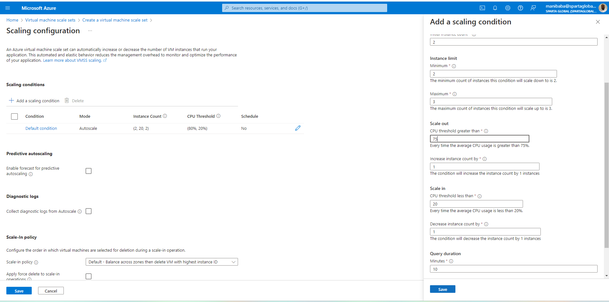
- **High availability** comes from your VMs being in different zones at the same time and launches a new instance if there is a lot of traffic. The default/ minimum of 2 VMs gives robustness
- **High scalability** comes from the VM scale set adapting when the set CPU load is reached<br>
### Set your user name SSH keys and license type
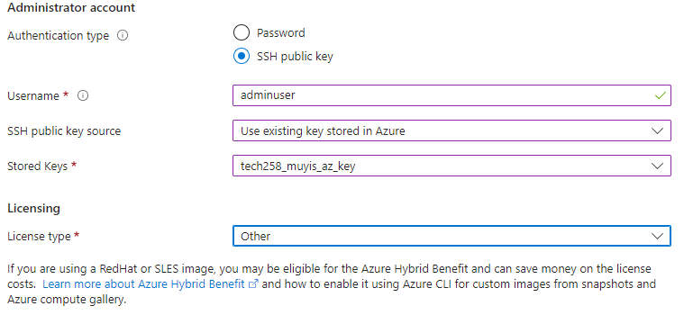
### Choose your disk type
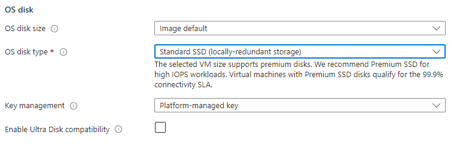
### Configure subnet
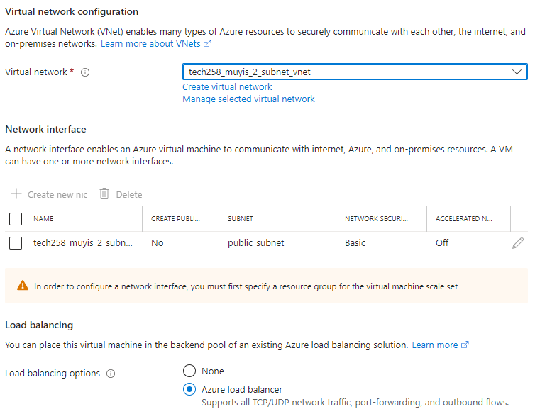
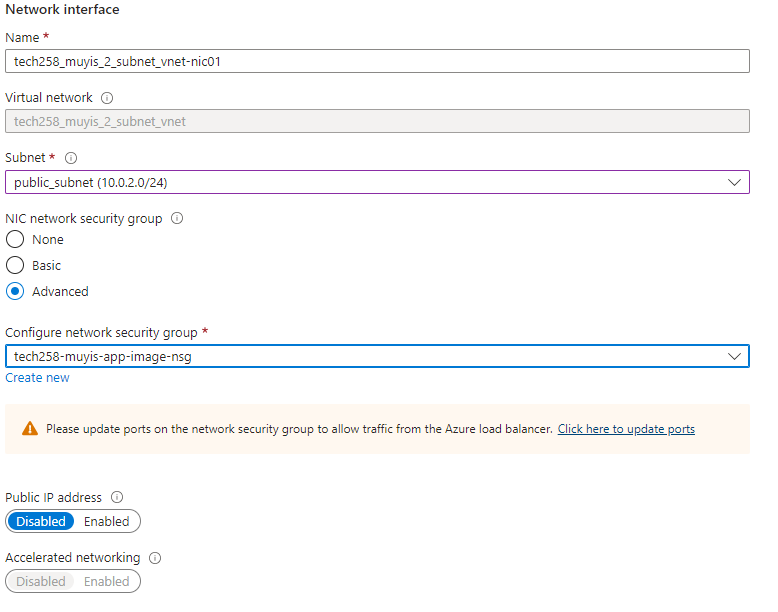
### Create your load balancer
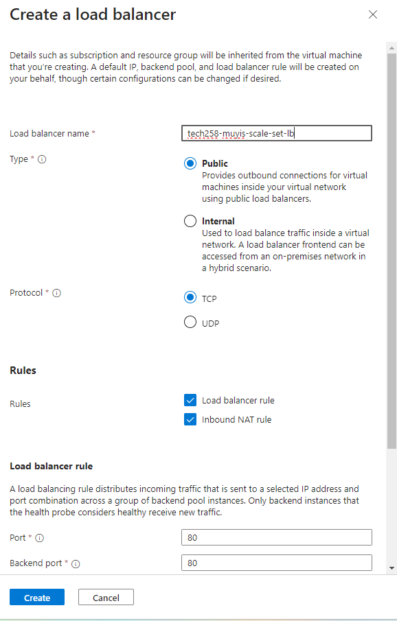
- An external Load balancer, organises internet traffic depending on the individual VMs capacity. If one instance goes down the load balancer routes traffic to a healthy working instance instead. It is like a traffic warden. It helps the availability of your scale set.
### Make your scale set auto repair
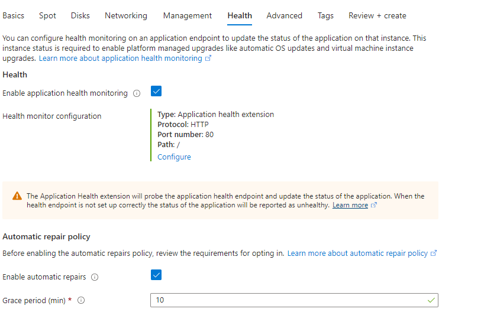
Where an instance is unhealthy for too long Azure has the capability to take the instance down and set up a new one with an updated user data if changed.
## Slap a little bit of user data in there
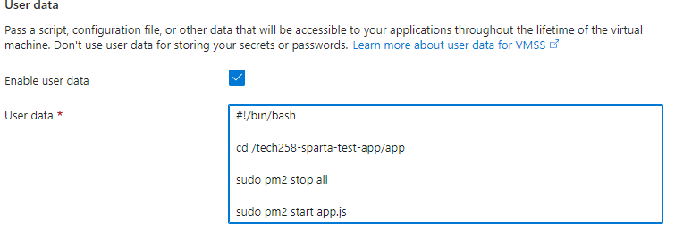 

## Managing intances
- **Reimaging:** Replaces instance
- **Upgrade:** Upgrades the user data/script of any running instances
### Differences
Upgrading will apply any changes that were applied to the scaleset as a whole. So for example, if you apply a new user data you need to upgrade the instances in order for that script to actually be applied.

If you select reimage, it will remove the VMSS instance and replace it with a brand new one. This can be used if you are having issues with a single instance and want to essentially delete it and redeploy it.

## Deleting scale set
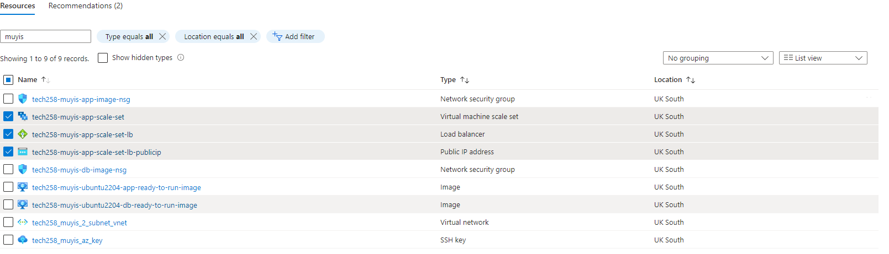
1. Delete IP address
2. Delete load balancer
3. Delete scale set

## Unhealthy instances
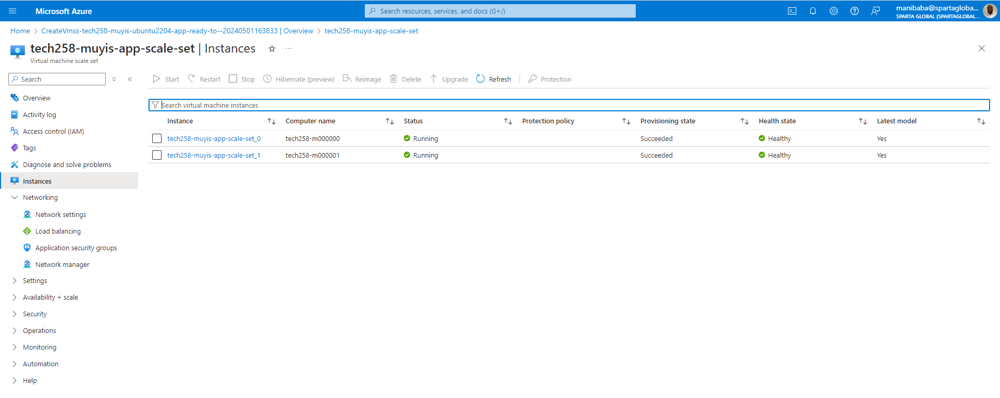
When your instance doesn't return 200 it is considered unhealthy this can be by stopping the instance or inputting incorrect user data. <br>
In this demo I set the repair time to 10 minutes meaning after 10 minutes Azure will close the unhealthy instance and create a new one

## SSH into instance
Your load balancer connects to your intances starting from port 50000 (this can be changed in load balancer config) so to SSH in would be a bit different<br>
```bash
ssh -i ~/.ssh/tech258_muyis_az_key -p 50001 adminuser@4.158.77.222
```
This uses the port number `-p` of the second instance with my load balance IP address