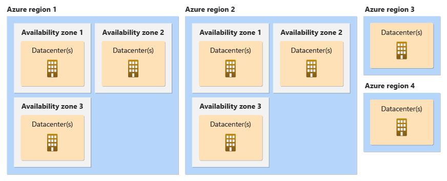
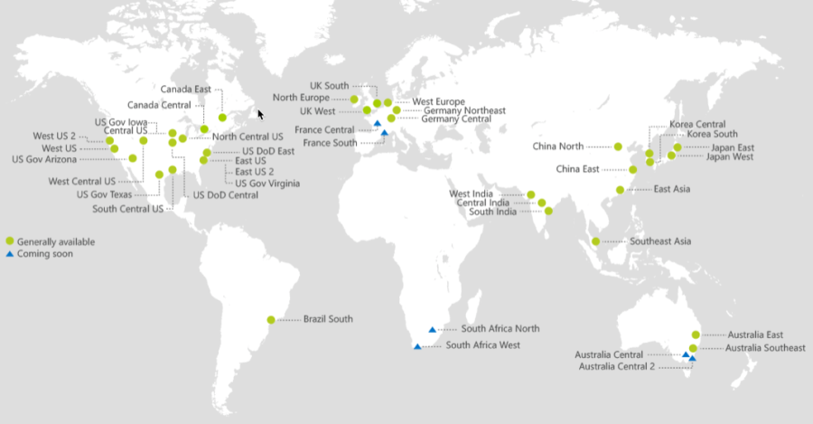
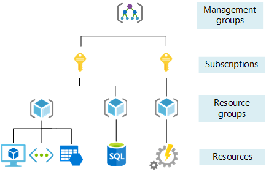

# Intro to Azure
- [Intro to Azure](#intro-to-azure)
  - [Basics of Azure:](#basics-of-azure)
  - [Azure Regions and Availability Zones:](#azure-regions-and-availability-zones)
  - [Azure Structure/Organization:](#azure-structureorganization)
  - [Types of Services in Azure:](#types-of-services-in-azure)
  - [Ways to Access Azure:](#ways-to-access-azure)
  - [Azure vs. Azure DevOps:](#azure-vs-azure-devops)
    - [Azure](#azure)
    - [Azure DevOps](#azure-devops)
  - [Azure Pricing Calculator:](#azure-pricing-calculator)

## Basics of Azure:
Azure is a cloud computing platform and set of services offered by Microsoft. It provides a wide range of cloud services, including computing, storage, networking, databases, analytics, artificial intelligence (AI), Internet of Things (IoT), and more. Azure allows businesses to build, deploy, and manage applications and services through Microsoft's global network of data centers.

## Azure Regions and Availability Zones:
Azure is organized into regions, which are geographic locations around the world where Microsoft has data centers. Each region is made up of one or more data centers. These regions are further divided into Availability Zones, which are physically separate data centers within a region that are connected through high-speed, private networks. Availability Zones provide redundancy and fault tolerance, ensuring high availability and reliability for Azure services.

Here's an example diagram illustrating Azure regions and Availability Zones:

## Azure Structure/Organization:
Azure is structured into various categories of services, including Compute, Storage, Networking, Databases, AI + Machine Learning, Internet of Things (IoT), Developer Tools, and more. These services are organized into different groups within the Azure portal for easy access and management.  
**Resource groups** Services are grouped into resource groups, resource group are associated with subscriptions. It is standard to separate resource groups rather than having a rescource group within a resource group. 
**Subscriptions**
There are limits and quotas in every sub, for example, you can have 50 VM machines *of the same size* in one region, after 50 you get an error. 
**Management groups** These are likened to folders as you can have 6 levels within a management group. 

## Types of Services in Azure:
Azure provides a wide range of services, including:

- **Compute:** Virtual machines, containers, serverless computing (Azure Functions), and batch processing.
- **Storage:** Blob storage, file storage, table storage, and disk storage.
- **Networking:** Virtual networks, load balancers, VPN gateways, and CDN (Content Delivery Network).
- **Databases:** SQL Database, Cosmos DB (NoSQL), Azure Synapse Analytics, and MySQL.
- **AI + Machine Learning:** Azure Cognitive Services, Azure Machine Learning, and Bot Service.
- **IoT:** IoT Hub, IoT Central, and Azure Sphere.
- **Developer Tools:** Azure DevOps, Visual Studio, and GitHub integration.
## Ways to Access Azure:
There are several ways to access and manage Azure resources:

- **Azure Portal:** A web-based interface for managing Azure services.
Azure CLI (Command-Line Interface): A command-line tool for managing Azure resources.
- **Azure PowerShell:** A set of cmdlets for managing Azure resources through PowerShell.
- **Azure REST API:** Allows programmatic access to Azure services through HTTP requests.
- **Azure SDKs:** Software development kits for various programming languages to interact with Azure services.
- **Azure Mobile App:** Allows monitoring and managing Azure resources from mobile devices.

## Azure vs. Azure DevOps:
### Azure 
Azure is a cloud computing platform that provides various infrastructure and platform services for building, deploying, and managing applications and services. It includes services such as compute, storage, networking, databases, and more.
### Azure DevOps 
Azure DevOps is a set of development tools and services for software development teams. It includes services for version control (Azure Repos), continuous integration/continuous deployment (Azure Pipelines), project management (Azure Boards), testing (Azure Test Plans), and package management (Azure Artifacts). Azure DevOps helps teams collaborate and automate the software delivery process.

## Azure Pricing Calculator:
The Azure Pricing Calculator is a tool provided by Microsoft to estimate the cost of using Azure services. It allows users to select the Azure services they need, specify usage details (such as region, instance size, and storage capacity), and generate a cost estimate based on current pricing rates. The Pricing Calculator helps users plan and budget for their Azure deployments by providing transparency and visibility into the cost of using Azure services. It also allows users to compare pricing options and optimize their configurations to minimize costs.