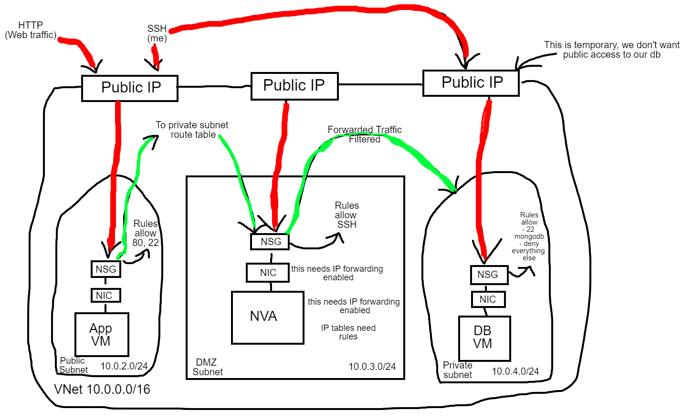
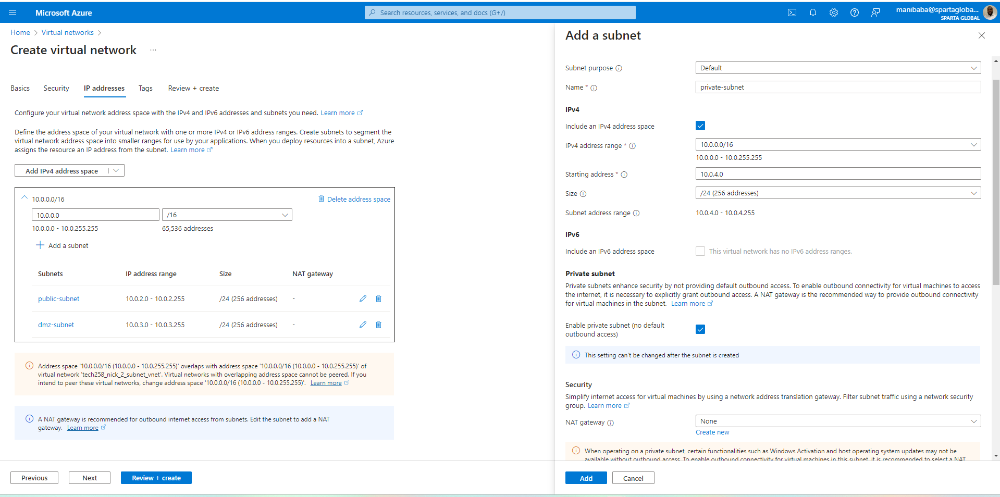
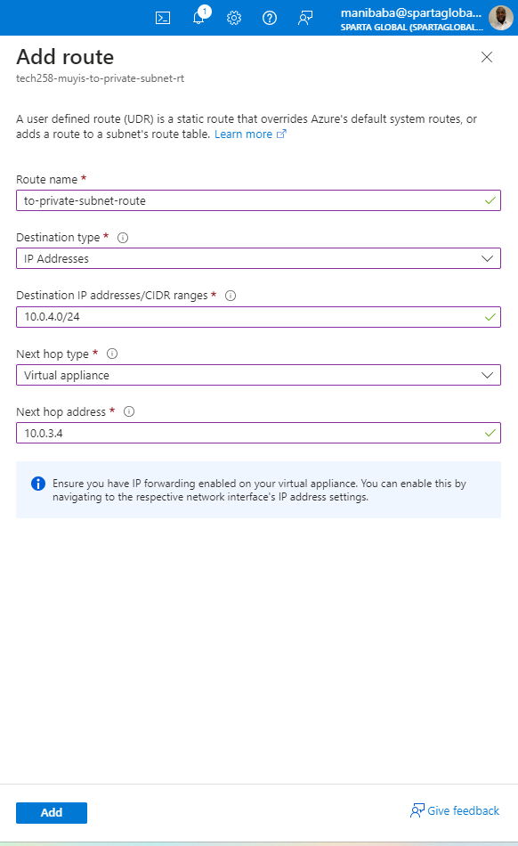
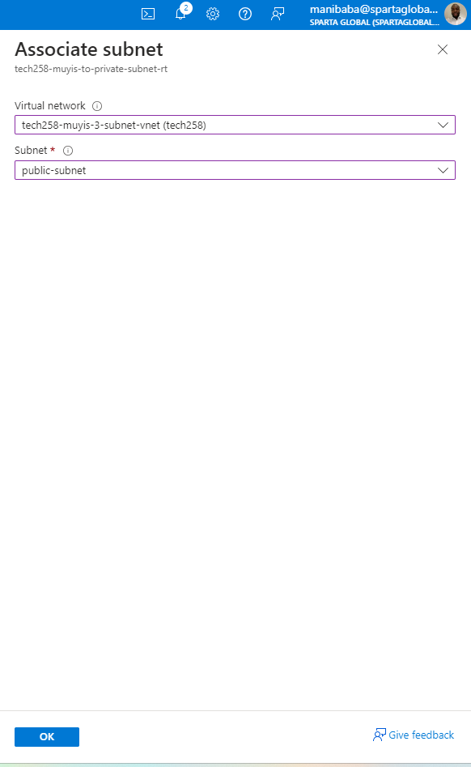
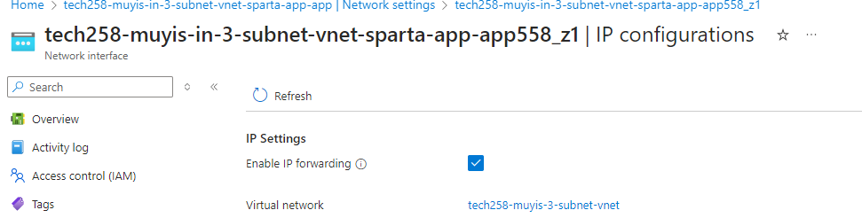
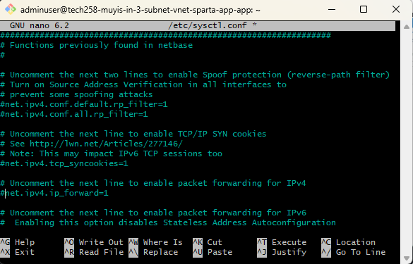
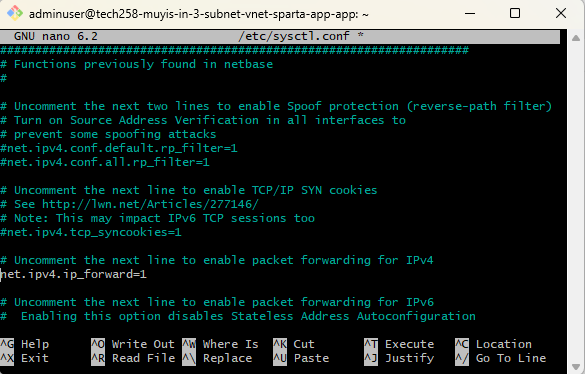
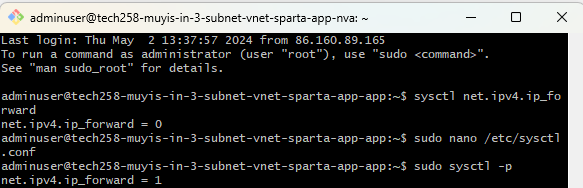

# Securing subnets
Diagram showing how a DMZ works and the routes concerning a 2 tier app.

## Notes
Adding a DMZ adds layers to enforce security<br>
Demilitarized zone DMZ subnet is you firewall it filters traffic only allow certain traffic into your db subnet.<br>
There are **system routes** when any device can talk to any device, we are setting up **user routes** which is a specific path (app -->db via NVA) <br>

**Next steps**
## SETUP NVA IN DMZ SUBNET 

On AWS by defualt there is no outbound access, meaning things in our private subnet would not be able to communicate with things outside the the VNET. You cannot request things from the internet
1. Create new VNET with 3 subnets enable private subnet for db
2. Create VM for db then app and NVA 
3. Ping db from app to db to test if they're communicating and how fast the response is `ping 10.0.4.4`
4. Set up route table and associate with public subnet (where we start the control)

<br>
**NOTE** The ping stops, because the NVA doesn't know what to do with them, it doesn't know to forward them on.
5. IP fowarding setup for NIC AND VM (go to NVA networking to enable IP forwarding in NIC)

SSH into NVA and execute `sudo nano /etc/sysctl.conf` and uncomment net.ipv4.ip_forward. You can use `sysctl net.ipv4.ip_forward` to check we want it = 1<br>


<br>
Reload rules of file `sudo sysctl -p`
6. Configure IP table using this script `config-ip-tables.sh` (do an update upgrade first)
```bash
#!/bin/bash
 
# configure iptables
 
echo "Configuring iptables..."
 
# allow traffic on the loopback interface both for incoming and outgoing traffic
sudo iptables -A INPUT -i lo -j ACCEPT
sudo iptables -A OUTPUT -o lo -j ACCEPT
 
# allows incoming traffic that is part of an established connection or related to an established connection
sudo iptables -A INPUT -m state --state ESTABLISHED,RELATED -j ACCEPT
 
# Allows outgoing traffic that is part of an established connection
sudo iptables -A OUTPUT -m state --state ESTABLISHED -j ACCEPT
 
# Drops incoming packets that are not part of any established connection
sudo iptables -A INPUT -m state --state INVALID -j DROP
 
# Allows incoming SSH (TCP port 22) connections and outgoing responses to those connections.
sudo iptables -A INPUT -p tcp --dport 22 -m state --state NEW,ESTABLISHED -j ACCEPT
sudo iptables -A OUTPUT -p tcp --sport 22 -m state --state ESTABLISHED -j ACCEPT
 
# uncomment the following lines if want allow SSH into NVA only through the public subnet (app VM as a jumpbox)
# this must be done once the NVA's public IP address is removed
#sudo iptables -A INPUT -p tcp -s 10.0.2.0/24 --dport 22 -m state --state NEW,ESTABLISHED -j ACCEPT
#sudo iptables -A OUTPUT -p tcp --sport 22 -m state --state ESTABLISHED -j ACCEPT
 
# uncomment the following lines if want allow SSH to other servers using the NVA as a jumpbox
# if need to make outgoing SSH connections with other servers from NVA
#sudo iptables -A OUTPUT -p tcp --dport 22 -m conntrack --ctstate NEW,ESTABLISHED -j ACCEPT
#sudo iptables -A INPUT -p tcp --sport 22 -m conntrack --ctstate ESTABLISHED -j ACCEPT
 
# Allows TCP traffic from the source network 10.0.2.0/24 destined for the destination network 10.0.4.0/24 on port 27017 (presumably MongoDB) to pass through the firewall.
sudo iptables -A FORWARD -p tcp -s 10.0.2.0/24 -d 10.0.4.0/24 --destination-port 27017 -m tcp -j ACCEPT
 
# Allows ICMP (ping) traffic from the source network 10.0.2.0/24 to the destination network 10.0.4.0/24, both for new requests and for established connections (replies).
sudo iptables -A FORWARD -p icmp -s 10.0.2.0/24 -d 10.0.4.0/24 -m state --state NEW,ESTABLISHED -j ACCEPT
 
# Sets the default policy for the INPUT chain to DROP, meaning that unless explicitly allowed by rules above this command, all incoming traffic will be dropped.
sudo iptables -P INPUT DROP
 
# Sets the default policy for the FORWARD chain to DROP, meaning that unless explicitly allowed by rules above this command, all forwarded traffic will be dropped.
sudo iptables -P FORWARD DROP
 
echo "Done!"
echo ""
 
# make iptables rules persistent
# it will ask for user input by default
 
echo "Make iptables rules persistent..."
sudo DEBIAN_FRONTEND=noninteractive apt install iptables-persistent -y
echo "Done!"
echo ""
```


**Some extra things we can do for security**
- STRICTER RULES IN NSG IN PRIVATE SUBNET
- DELETE PUB IP ON DB VM