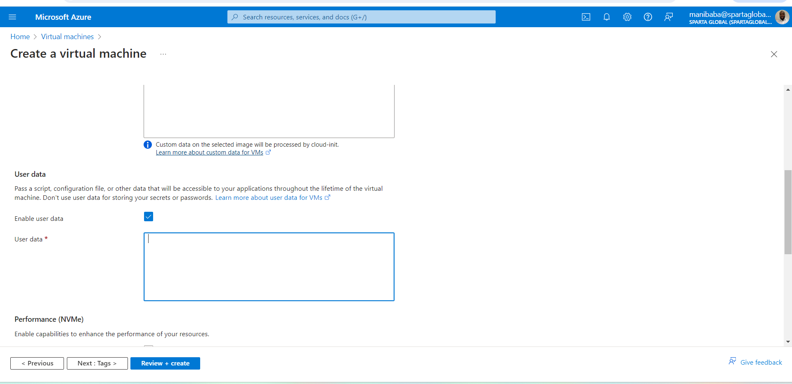

# User data
This is an advanced way of creating a virtual machine. By using this option when creating a VM we can run a script without having to SSH into the intance.
## Option in Azure
 
In the blue highlighted box you can paste your script and it will run once the VM is created, everything should be fine **IF YOUR SCRIPT WORKS!!!**
# Image 
This is a snapshot of the OS or an exact replica of the disk (like a preset). 
When creating VM with custom image, the script is set up as a system process so it starts up every time on bootup, the app is not start as it is not a system process (npm commands are not system commands), meaning when using images sometimes you may need a bit of user data to get the app running with the righ variables. 
When using user data, script auto runs after creation of machine, the commands run as fast as putting them in manually, for the image the commands don't have to run (or less commands are run) because everything is installed and configured. 
After creating your image, the VM that you captured will be stopped!!
### Understanding Automation
 
The above image shows a graph of how fast an apps runs against time to deploy. As shown by the graph the fastest way to deploy and run an app (that I have learnt at this point of time) is using a preset image.
## Option for image
 
After click the option to capture your VM you will be taken to this page, make sure to choose "Capture only a managed image".